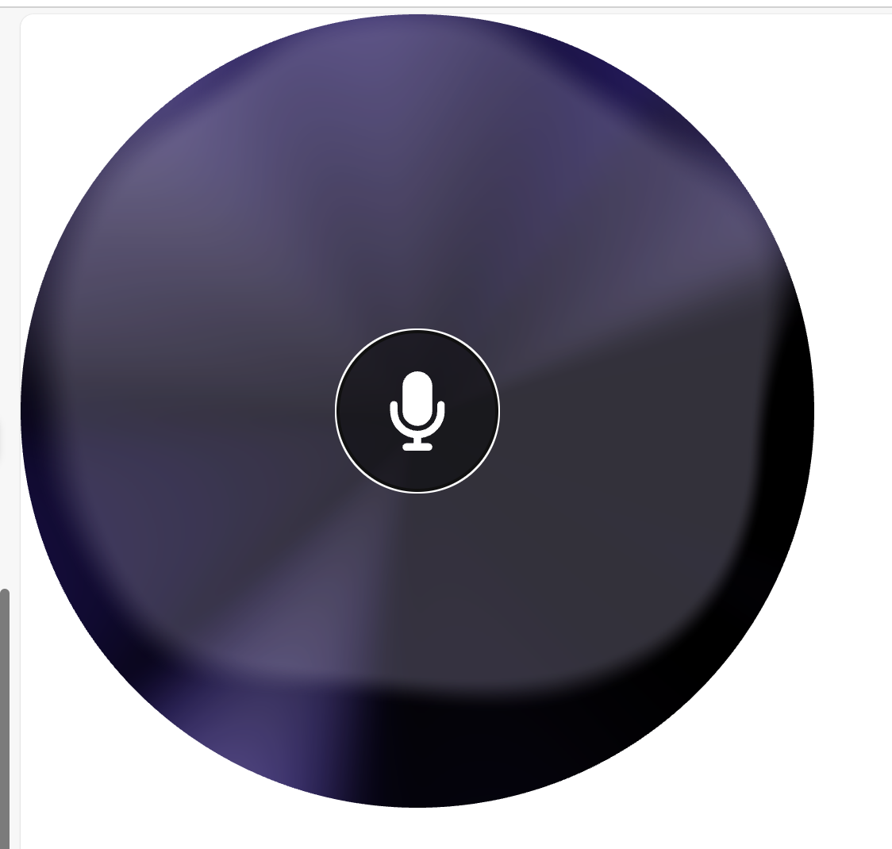
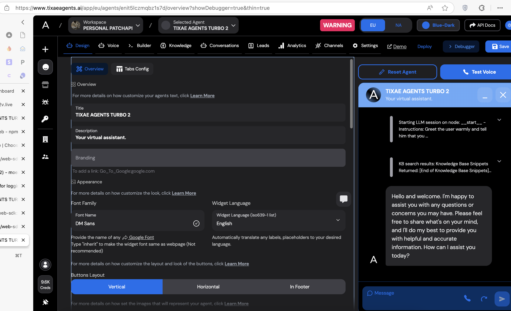

## TIXAE Agents React Voice Orb


## Get started:

Make sure to update the package regularly to the latest version.

```bash
pnpm install @tixae-labs/react-voice-orb@latest
```
Or
```bash
npm install @tixae-labs/react-voice-orb@latest
```

---

First of all please navigate to the [TIXAE Dashboard](https://tixaeagents.ai/login) and create an agent, then you can use the agent id and region to start a voice call.

We need to know 2 parameters to start a voice call from the URL of the agent you have navigated to:

1. `agentId` - The agent id is a unique identifier for the agent you want to call.
2. `region` - The region is the region of the agent you want to call.



For example this URL:

```
https://www.tixaeagents.ai/app/eu/agents/enit5lczmqbz1s7d/overview?showDebugger=true&thin=true
```

The `agentId` is `enit5lczmqbz1s7d` and the `region` is `eu`.

---

Example usage with NextJS 13+ (App Router + TypeScript)

- We first have to wrap the page/component with the `VoiceProvider` and `OrbThemeProvider` components.
```tsx
// layout.tsx
"use client";
import React from "react";
import { VoiceProvider, OrbThemeProvider } from "@tixae-labs/react-voice-orb";

const layout = (props: { children: React.ReactNode }) => {
  return (
    <VoiceProvider
      agentId="ox0uepumt3qokr98"
      region="eu"
    >
      <OrbThemeProvider isDark={true} primaryColor="#CBC3E3">
        {props.children}
      </OrbThemeProvider>
    </VoiceProvider>
  );
};

export default layout;
```

- Then we can use the `useAIVoice` hook and the orb component.
```tsx
// page.tsx
"use client";
import { AudioAnimationOrb, useAIVoice, Spinner } from "@tixae-labs/react-voice-orb";
import React, { useState } from "react";
import { FaCircleStop, FaMicrophone, FaMicrophoneSlash } from "react-icons/fa6";


const page = () => {

  const { webCall, callState, isMuted } = useAIVoice();
  const [showOrb, setShowOrb] = useState(false);

  return (
      <AudioAnimationOrb
        orbPlaceholder={
          <div
            style={{
              width: "100%",
              height: "100%",
              backgroundColor: "#e1e1e1",
              borderRadius: "50%",
            }}
          ></div>
        }
        showOrb={showOrb}
        width={500}
        height={500}
      >
        <div
          style={{
            width: 500,
            height: 500,
            backgroundColor: "rgba(0, 0, 0, 0.1)",
            borderRadius: "100%",
            display: "flex",
            justifyContent: "center",
            alignItems: "center",
          }}
        >
           <div
          className="ta-orb-controls"
          style={{
            display: "flex",
            flexDirection: "column",
            alignItems: "center",
            justifyContent: "center",
            height: "100%",
            width: "100%",
            backgroundColor: "transparent",
            color: "#fff",
            padding: "10px 20px",
            borderRadius: "5px",
          }}
        >
          <button
            className="ta-button"
            style={{
              backgroundColor: callState === "connected" ? "rgba(250, 0, 0, 0.5)" : "rgba(0, 0, 0, 0.5)",
              color: "#fff",
              padding: "10px 20px",
              borderRadius: "100%",
              width: "100px",
              height: "100px",
              display: "flex",
              justifyContent: "center",
              alignItems: "center",
            }}
            onClick={() => {
              if (!showOrb) {
                setShowOrb(true);
                return;
              }
              if (callState === "idle") {
                webCall.startCall();
              } else {
                // tixaeVoice?.endCall();
                webCall.toggleMute();
              }
            }}
          >
            {callState === "idle" ? (
              <FaMicrophone style={{ width: "50px", height: "50px" }} />
            ) : null}
            {callState === "connecting" ? <Spinner /> : null}
            {callState === "connected" ? (
              <>
                {isMuted ? (
                  <FaMicrophoneSlash
                    style={{ width: "50px", height: "50px" }}
                  />
                ) : (
                  <FaMicrophone style={{ width: "50px", height: "50px" }} />
                )}
              </>
            ) : null}
          </button>
          {callState === "connected" ? (
            <>
              <button
                style={{
                  marginTop: `10px`,
                  display: `flex`,
                  alignItems: `center`,
                  justifyContent: `center`,
                  gap: `10px`,
                  padding: `10px 20px`,
                  backgroundColor: `rgba(0, 0, 0, 0.5)`,
                  borderRadius: `10px`,
                }}
                className="ta-button-end"
                onClick={() => {
                  webCall.endCall();
                }}
              >
                End Call
                <FaCircleStop style={{ width: "20px", height: "20px" }} />
              </button>
            </>
          ) : null}
        </div>
        </div>
      </AudioAnimationOrb>
  );
};

export default page;
```

We can also append messages to the conversation by passing the `options` parameter to the `init` method, in addition to overriding tools or variables for the agent.
```tsx
// page.tsx
await voice.init({
  agentId: "LPTp73I6VFsI0jFVFAPr",
  region: "eu",
  options: {
    messagesHistory: [
      {
        role: "assistant",
        content: "Hi there, how can I help you today?",
      },
      {
        role: "user",
        content: "I'm good my name is Moe btw.",
      },
    ],
  },
});
```

Notes:
- This packages uses WebRTC to make the voice call, any browser that doesn't support that might not be compatible with this package.
- We use WebGL to render the orb, so it might not work on all devices/browsers.
  
---

```
MIT License

Copyright (c) 2025 Moe Ayman - TIXAE LLC

Permission is hereby granted, free of charge, to any person obtaining a copy
of this software and associated documentation files (the "Software"), to deal
in the Software without restriction, including without limitation the rights
to use, copy, modify, merge, publish, distribute, sublicense, and/or sell
copies of the Software, and to permit persons to whom the Software is
furnished to do so, subject to the following conditions:

The above copyright notice and this permission notice shall be included in all
copies or substantial portions of the Software.

THE SOFTWARE IS PROVIDED "AS IS", WITHOUT WARRANTY OF ANY KIND, EXPRESS OR
IMPLIED, INCLUDING BUT NOT LIMITED TO THE WARRANTIES OF MERCHANTABILITY,
FITNESS FOR A PARTICULAR PURPOSE AND NONINFRINGEMENT. IN NO EVENT SHALL THE
AUTHORS OR COPYRIGHT HOLDERS BE LIABLE FOR ANY CLAIM, DAMAGES OR OTHER
LIABILITY, WHETHER IN AN ACTION OF CONTRACT, TORT OR OTHERWISE, ARISING FROM,
OUT OF OR IN CONNECTION WITH THE SOFTWARE OR THE USE OR OTHER DEALINGS IN THE
SOFTWARE.
```